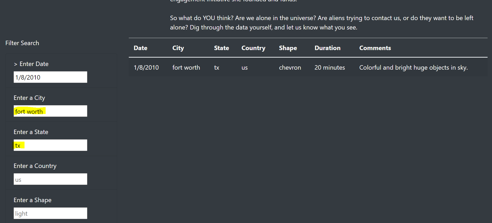

# UFOs

## Overview of Project
The purpose of this project was to develop an interactive webpage about UFOs sightings around the world.
 
 
The objectives were to:
- create a table using data stored in a JavaScript array,
- create filters to make the table react to user input,
- place the table into an HTML file for easy viewing,
- and customize the webpage using Bootstrap.

## Resources
- Data Sources: [data.js](static/js/data.js)
- Software: D3.js 4.11.0; Bootstrap 4.0.0; Visual Studio Code 1.53.2

## Results
The webpage can easily be used to filter through sightings of UFOs by Date, City, State, Country, and Shape. For example, entering a date will filter out all sightings for that specific day. In the example below, entering the date of 1/8/2010 returned results for sightings reported on that date.
 
 

 
The user can filter the result further by adding the city and state. In the example below, adding the additional filter of Fort Worth, TX returned all reported sighting for that location on 1/8/2010.
 

 
 
As more filters are added, the search is narrowed down to fit the search criteria.

## Summary
A drawback of this design is that all of the data is listed on one page, which could be troublesome for some users, as they will be required to scroll and scroll through the data. A recommendation for improvement is to place the data on multiple webpages (i.e., 20 results on each page), utilizing a numbered navigation bar at the bottom of the page. The page can also be further developed by adding a feature in the Filter Search input boxes that displays suggestions as users type. If there is data available for the text that is being typed, the suggestion would pop up. If not, no text will pop up, immediately notifying the user that there is no data available for that filter.
